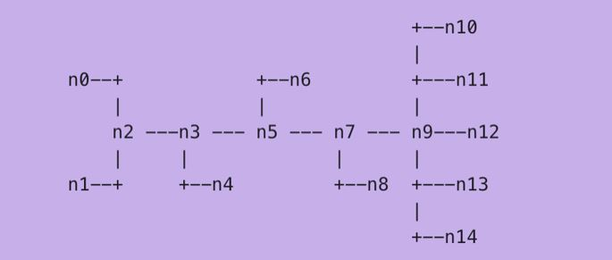

## TCP Congestion Control using TCP Reno Protocol

TCP Congestion control using TCP Reno Protocol along with DropTail &amp; RED mechanism

### Objective:

-	Simulation and demonstration of TCP Congestion Control using NS3
-	To setup TCP flows, select the best available TCP protocol and deploy it to handle the congestion.
-	To analyse the simulation for parameters like Throughput and Buffer size.
-	To analyse and compare the queuing mechanisms like DropTail and RED for different parameters to further improve efficiency.

### Selection of Protocol

There are 3 popular Congestion Control mechanism out of which TCP Tahoe and Reno versions (and their variants) are widely used in the current Internet, with TCP Reno being the dominant one. 

We have another mechanism which is TCP Vegas can obtain even 40% higher throughput than TCP Reno, but suffers from serious performance degradation and there exists an inevitable trade-off between fairness and throughput. 

Hence, TCP Reno is selected for implementation.

### Software Requirements

1. NS-3 - [Installation guide](https://www.nsnam.org/wiki/Installation#Ubuntu.2FDebian.2FMint)
2. TraceMetrics - [Download Link](https://sourceforge.net/projects/tracemetrics/)
3. Ubuntu 20.04 - setup in [Virtual Box](https://www.virtualbox.org/) if isn't in your Desktop

### Topology

### Parameters

1. Global Variables:
    - RouterLink Rate : 10Mbps
    - RouterLink Delay : 100us 
    - Packet Generation Rate : 2MBPS
    - Packet Length : 1400
    - Max Segment Size : 1000 
    - Window Size : 20000
    - Initial cwnd : 1

2. Mechanism related parameters:
    - Buffer Size : 1400,2800,4200,5600,7000
    - Min & Max threshold : 1 & 3 (for RED only)

### Results & Graphs

In this project, we have successfully employed and analysed TCP Reno for congestion control. It is analysed that unlike TCP Tahoe, one of TCP’s earliest variant, TCP Reno is not that aggressive in the reduction of the congestion window and takes precautions on the basis of the light or heavy congestion detected. 

Drop Tail and RED queuing mechanisms are compared and it is found that RED being a relatively random algorithm than Drop Tail which always drops packets at the end, RED performs better. This is because RED can control the average queue length, the congestion situation and hence provides higher throughput and lesser packet loss.

All the graphs plotted can be observed [here](https://github.com/nikita9604/TCP-Congestion-Control/blob/main/Result%20%26%20Graphs.pdf) using Trace Metrics.
